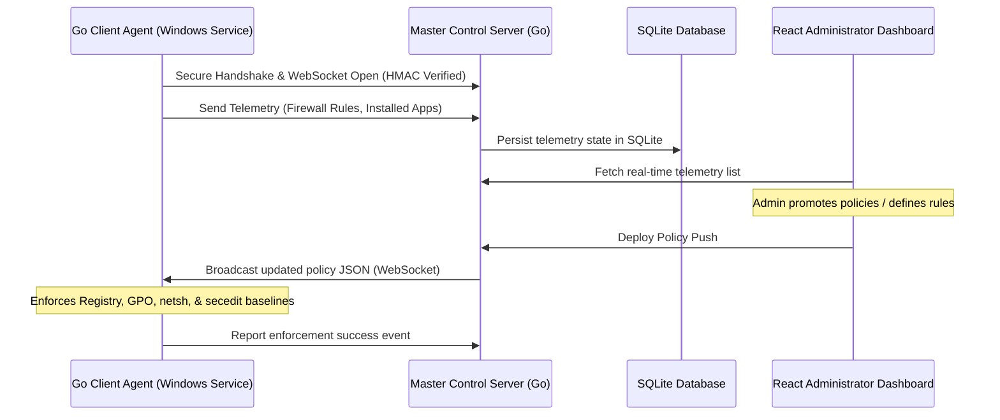

# Windows Policy Security Manager (WWPO)

A lightweight, decentralized security orchestrator designed for Windows Workgroups. The Windows Workgroup Policy Orchestrator (WWPO) provides centralized security baseline enforcement, active-directory-like policy deployment, and real-time endpoint telemetry audit loops without requiring a domain controller.

---

## 1. System Architecture



---

## 2. Key Features

*   **Real-time Bi-directional Telemetry**: Agents automatically push active local firewall rules and installed applications lists on connection.
*   **Idempotency & Duplicate Prevention**: The policy manager runs validation checks on rule promotion and manual input to prevent policy bloating and duplicates.
*   **Decentralized Active Enforcement**: Agents cache policies locally (`policy_cache.json`) to retain security baselines while offline.
*   **Scheduled Self-Healing**: A background thread audits security baselines every 60 seconds and auto-heals drifted parameters.
*   **Single-Binary Server**: The Master server wraps both the HTTP API endpoints and the React frontend assets into a single compiled executable using Go embedding.

---

## 3. Installation & Deployment Guide

Ready-to-use binaries and deployment scripts are located in the [**`release/`**](./release/) directory (or as a consolidated [**`release.zip`**](./release.zip) package).

### A. Deploying the Master Control Server (Windows & Linux)

The Master Server serves the management API and hosts the admin panel on port **`8080`**.

#### 1. Linux Setup (Systemd Service)
1. Copy the executable and service descriptor:
   ```bash
   sudo mkdir -p /opt/wwpo-master
   sudo cp release/master-server/master-server /opt/wwpo-master/
   sudo cp release/master-server/wwpo-master.service /etc/systemd/system/
   ```
2. Enable and start the daemon:
   ```bash
   sudo systemctl daemon-reload
   sudo systemctl enable wwpo-master.service
   sudo systemctl start wwpo-master.service
   ```
3. Open your browser and navigate to: **`http://localhost:8080/`**

#### 2. Windows Setup
Launch Command Prompt or PowerShell as Administrator and execute:
```cmd
.\release\master-server\master-server.exe
```

---

### B. Deploying the Client Agent (Windows)

The client agent runs in the background as a Windows Service under the LocalSystem account.

1. Copy the `/release/client-agent/` directory to the target Windows machine.
2. Open PowerShell as **Administrator**.
3. Run the installer script:
   ```powershell
   Set-ExecutionPolicy Bypass -Scope Process -Force
   .\install.ps1
   ```
4. The installer will:
   * Prompt for the **Master Server IP**, port, and the **Enrollment Setup Token**.
   * Copy `agent.exe` into `C:\ProgramData\WWPO`.
   * Secure the configuration files (`config.json`) so they are only accessible to `SYSTEM` and `Administrators`.
   * Install and start the **`WWPOAgent`** Windows Service.

#### Uninstalling the Agent
To remove the agent and clean up local configurations, run:
```powershell
.\uninstall.ps1
```

---

## 4. Administrative Operations

### Generating Setup Tokens
Enrollment tokens bind new client agents to specific logical workgroups. You can generate tokens directly using the Master server CLI:

```bash
# On Linux
/opt/wwpo-master/master-server --gentoken "DEVELOPERS" --duration 120

# On Windows
.\master-server.exe --gentoken "DEVELOPERS" --duration 120
```
Parameters:
* `--gentoken`: Name of the target logical workgroup.
* `--duration`: Token lifetime in minutes (default is 120).

---

## 5. Development & Compilation

To rebuild the project binaries from source:

### Rebuilding the Master Server (with Embedded WebUI)
1. Build the React Frontend:
   ```bash
   cd master-frontend
   npm install && npm run build
   ```
2. Embed and build the Go Server:
   ```bash
   rm -rf ../master-backend/dist && cp -r dist ../master-backend/dist
   cd ../master-backend
   GOOS=linux GOARCH=amd64 go build -ldflags="-s -w" -o master-server
   GOOS=windows GOARCH=amd64 go build -ldflags="-s -w" -o master-server.exe
   ```

### Rebuilding the Windows Client Agent
```bash
cd client-agent-go
GOOS=windows GOARCH=amd64 go build -ldflags="-s -w" -o agent.exe
```
