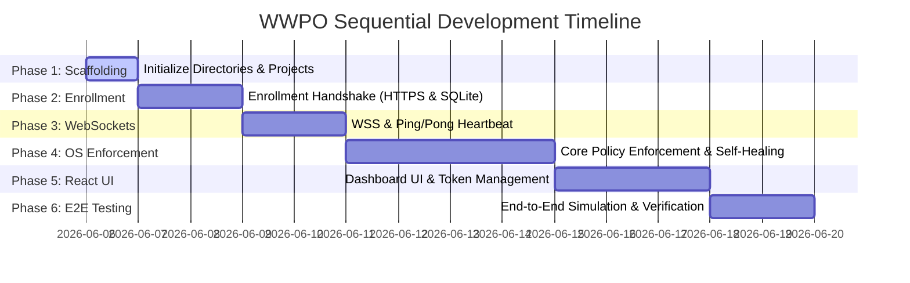

# Implementation Plan - WWPO Sequential Development

This document outlines the step-by-step execution roadmap to develop the **Windows Workgroup Policy Orchestrator (WWPO)**. We will progress through six sequential phases, starting with scaffolding, building communication and enrollment protocols, implementing the native Windows policy enforcement modules, developing the React UI, and completing end-to-end verification.

---

## User Review Required

> [!IMPORTANT]
> Since this is a native Windows tool managing system security, the development of the C# Client Agent requires elevated administrative privileges to run/test on Windows. However, we can build the C# codebase in a cross-platform manner and mock the OS calls (Registry, Secedit, COM interfaces) for verification purposes. Please let me know if you would like Windows mock-drivers enabled by default for local development.

---

## Proposed Changes & Roadmap

---

### Phase 1: Project Scaffolding
Initialize the workspace directories and create the skeleton structures for the three services.

#### [NEW] [go.mod](file:///home/user/dev/AD_controller/master-backend/go.mod)
* Initialize Go backend module.
* Install dependencies: `github.com/mattn/go-sqlite3`, `github.com/gorilla/websocket`, `github.com/google/uuid`.

#### [NEW] [WWPO.Agent.csproj](file:///home/user/dev/AD_controller/client-agent/WWPO.Agent.csproj)
* Create a .NET Core Worker Service project.
* Install dependencies: `Newtonsoft.Json`, `System.ServiceProcess.ServiceController` (for service lifecycle).

#### [NEW] [package.json](file:///home/user/dev/AD_controller/master-frontend/package.json)
* Create React single page application configurations.

---

### Phase 2: Secure Handshake & Enrollment (Go + SQLite & C# Agent)
Establish secure database structures and build the HTTP REST endpoints to enroll new agents.

#### Go Backend:
* Implement SQLite database access layer (schema migrations for agents, tokens, and events).
* Implement POST `/api/v1/enroll` endpoint to validate setup tokens and generate/store `Agent_ID` and connection secrets.
* Implement console command or REST endpoint to generate setup tokens bound to Workgroup strings.

#### C# Client Agent:
* Build the enrollment client module. On service startup, it detects if credentials exist locally.
* If credentials do not exist, it makes an outbound HTTPS POST request to the Master with the setup token and metadata.
* Upon receiving the `Agent_ID` and shared connection secret, it writes them to a local configuration file with NTFS ACLs restricting read access to `NT AUTHORITY\SYSTEM`.

---

### Phase 3: WebSocket Connection & Heartbeat (Go + C# Agent)
Establish duplex, real-time communications.

#### Go Backend:
* Implement `/api/v1/connect` WebSocket upgrade handler.
* Authenticate the WebSocket upgrade request by verifying the HMAC-SHA256 signature of the timestamp using the client's shared connection secret.
* Store active connections in a thread-safe `sync.Map`.

#### C# Client Agent:
* Implement WebSocket connection manager with:
  * Exponential backoff retry logic (5s, 10s, 30s, 60s, 300s).
  * Heartbeat loop: Push `Ping` payload every 30 seconds; expect `Pong` response within 10 seconds.
  * Workgroup-string payload interception: Discard payloads targeting foreign workgroups.

---

### Phase 4: Local Policy Enforcement Modules (C# Agent Core)
Implement local Windows configuration execution modules.

#### C# Agent Modules:
1. **USB/Storage Blocking:** Native Registry class logic modifying `USBSTOR\Start` to `4` (Disabled) or `3` (Enabled).
2. **Software Restrictions:** Registry writing to Safer Code Identifier subkeys to add path/hash disallow rules.
3. **Firewall Orchestration:** Interop/COM or CLI wrapper calls to enable firewall profiles and sync rules.
4. **Account Hardening:** File parsing & configuration of `secedit.exe` INI-like templates.
5. **Windows Update scheduling:** Registry writes to configure automatic update settings and deferrals.
6. **Active Self-Healing Loop:** A 60-second background worker comparing current configurations with cached values and restoring compliance on deviations.

---

### Phase 5: React Admin Dashboard (Frontend)
Build the user interface.

* **Asset Panel:** Displays enrolled agents, their active workgroups, OS versions, last seen timestamps, and connection status.
* **Token Panel:** Interface to generate setup tokens bound to workgroups.
* **Policy Editor:** Form-based editor to create and serialize policies matching the target JSON structure and push them to specific workgroups.

---

### Phase 6: Integration & Verification
Perform end-to-end testing of the complete flow:
* Generate a token for a workgroup `FINANCE`.
* Enroll a client agent configured with `FINANCE`.
* Push a firewall policy and verify compliance.
* Manually disable the firewall on the client machine and verify the C# Agent reverts the change within 60 seconds (Self-Healing).
* Push a policy matching workgroup `MARKETING` and verify the `FINANCE` agent discards it.

---

## Verification Plan

### Automated Verification
* Unit tests for Go DB migrations and API controllers.
* Integration tests simulating agent enrollment token expiration.
* Reconnection tests to verify exponential backoff timing rules.

### Manual Verification
* Deploy the Go Master and the C# Agent (with mock drivers enabled if executing on non-Windows dev platforms).
* Log outputs to verify active state monitoring and policy caching.
