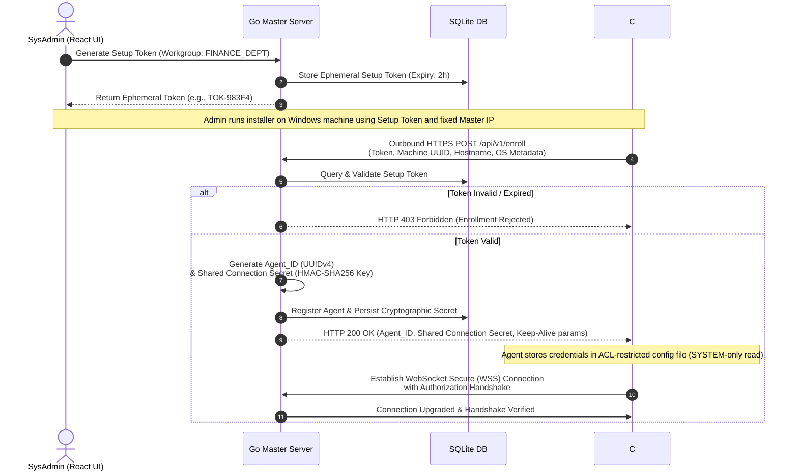

# Windows Workgroup Policy Orchestrator (WWPO)
## Product Requirement Document (PRD) & Technical Specification

---

### Document Control & Metadata
* **Author:** Principal Enterprise Systems Architect
* **Version:** 1.0.0
* **Date:** June 6, 2026
* **Status:** Draft for Review
* **Target Audience:** Engineering, Security Operations, and Infrastructure Teams

---

## 1. Executive Summary & Vision

The **Windows Workgroup Policy Orchestrator (WWPO)** is a lightweight, decentralized security and configuration management tool designed specifically for Windows environments lacking Active Directory (AD) infrastructure. In decentralized office environments, retail outlets, and isolated laboratory networks, computers often operate in standard Windows Workgroups. Without Active Directory Domain Services (AD DS) and Group Policy Objects (GPOs), systems administrators lack a centralized mechanism to enforce security postures, manage software restriction rules, configure local firewalls, harden accounts, or coordinate system updates.

WWPO fills this gap by establishing an on-premise, real-time, event-driven configuration engine. Utilizing a lightweight Master-Agent architecture, it enables centralized control of workgroup-joined endpoints over local networks, offering the security enforcement power of Active Directory without its administrative overhead, licensing costs, or domain controller dependencies.

---

## 2. Architecture Overview & System Topology

WWPO uses a centralized **Hub-and-Spoke (Master-Agent)** topology. The system is divided into two primary nodes: the **Master Node** (composed of a Go backend and React frontend dashboard) and the **Client Agent** (a native C# .NET Core Windows Service).

```mermaid
graph TD
    subgraph "Master Control Center (Hub)"
        UI["React Admin Dashboard (Browser)"] <-->|HTTPS / REST API| GoServer["Go Master Backend"]
        GoServer <--> DB[("SQLite Embedded Database")]
        GoServer <--> MemoryMap["Concurrent Conn Map (In-Memory)"]
    end
    
    subgraph "Network Boundaries"
        Router{"Local LAN Router"}
    end

    subgraph "Logical Network Isolation (Workgroups)"
        subgraph "Workgroup: FINANCE_DEPT"
            Agent1["C# Agent 01 (FINANCE_DEPT)"]
            Agent2["C# Agent 02 (FINANCE_DEPT)"]
        end
        subgraph "Workgroup: SALES_DEPT"
            Agent3["C# Agent 03 (SALES_DEPT)"]
            Agent4["C# Agent 04 (SALES_DEPT)"]
        end
    end

    %% Connections
    GoServer <--> Router
    Router <-->|Persistent WSS / TCP| Agent1
    Router <-->|Persistent WSS / TCP| Agent2
    Router <-->|Persistent WSS / TCP| Agent3
    Router <-->|Persistent WSS / TCP| Agent4

    style Master Control Center (Hub) fill:#1e1e2e,stroke:#313244,stroke-width:2px;
    style Logical Network Isolation (Workgroups) fill:#181825,stroke:#313244,stroke-width:2px;
```

### 2.1 Master Node (Hub)
* **Dedicated Central Server:** Hosted on an on-premise system with a fixed local IP address (e.g., `192.168.1.50`).
* **Go Backend Server:** 
  * Manages active TCP socket connections concurrently using an efficient `sync.Map` or mutex-protected map of `Agent_ID` to WebSocket connection pointers.
  * Exposes RESTful HTTP endpoints for React UI communication, token creation, and agent registration.
  * Embedded SQLite database structure tracks agents, enrollment tokens, active policies, and security alerts.
* **React Administrative UI:** 
  * Provides a web interface for generating enrollment tokens, assigning policies to workgroups, and monitoring agent health and policy compliance.

### 2.2 Client Agent (Spoke)
* **Native Windows Service:** Runs as a C# .NET Core service with elevated privileges (`NT AUTHORITY\SYSTEM`).
* **Persistent Connection:** Establishes a WebSocket connection back to the Master Node, shifting communication from traditional polling to event-driven push.
* **Local Policy Cache:** Maintains a local encrypted or ACL-protected cache of the last known configuration.
* **Self-Healing Loop:** Executes a background monitor thread to ensure that unauthorized local configuration changes are reverted to the Master's policy state.

---

## 3. Communication Model & Protocols

### 3.1 Network Topology & Multi-Tenancy
To enable simple configuration and strict logical boundaries without network subnets, WWPO utilizes the standard Windows **Workgroup string** as a logical tenant boundary.

* **Workgroup Filtering:** Each payload pushed from the Master contains a target `workgroup` identifier.
* **Agent Interception:** Upon receiving any payload via WebSocket, the Client Agent parses the root JSON envelope. If the payload's `workgroup` string does not match the Agent's configured Workgroup (e.g., an agent configured as `FINANCE_DEPT` receives a payload for `SALES_DEPT`), the Agent immediately discards the payload, raises a local audit warning, and takes no action. This prevents misdirected policy pushes from crossing administrative boundaries on a shared physical network.

### 3.2 Secure Multi-Step Token Handshake
To prevent unauthorized endpoints from enrolling or spoofing agents, WWPO implements a token-based cryptographic handshake.



#### Handshake Phase Details:
1. **Token Generation:** The system administrator uses the React UI to generate an ephemeral setup token (e.g., valid for 2 hours) bound to a specific Workgroup string (e.g., `FINANCE_DEPT`).
2. **Local Installation:** The administrator installs the Agent service on the target endpoint, supplying the Setup Token and the fixed Master IP/Domain.
3. **Outbound Enrollment Request:** The Agent makes an outbound HTTPS POST request to `https://<master_ip>:<port>/api/v1/enroll` containing:
   * Setup Token.
   * Machine UUID (derived from motherboard UUID and system MAC addresses).
   * Device hostname and operating system metadata.
4. **Validation and Key Derivation:** The Master verifies the setup token against SQLite. If valid, it:
   * Generates a permanent `Agent_ID` (UUIDv4).
   * Generates a high-entropy **Shared Connection Secret** used to sign future messages.
   * Disables or flags the setup token if it is single-use.
5. **Credentials Storing:** The Master returns the `Agent_ID` and the Connection Secret in the HTTPS response. The C# Agent saves these in a local file with NTFS permissions restricted to `NT AUTHORITY\SYSTEM`.

### 3.3 Connection Upkeep & Keep-Alives
* **WebSocket Handshake Auth:** The agent initiates the WebSocket upgrade request at `wss://<master_ip>:<port>/api/v1/connect`. It includes the `Agent_ID` and a SHA256 HMAC signature generated by signing the current timestamp with its **Shared Connection Secret**.
* **Ping/Pong Protocol:**
  * To maintain the TCP connection through stateful firewalls and detect dead nodes, a lightweight ping/pong heartbeat is executed.
  * Every 30 seconds, the C# Agent pushes a `Ping` text payload or a WebSocket Ping frame.
  * The Go Master must respond with a `Pong` payload within 10 seconds.
  * If the Agent misses 2 consecutive Pongs, or if the socket reports an error, the Agent terminates the socket and enters the resilience state.

### 3.4 Resilience & Self-Healing
* **Exponential Backoff Reconnection:** Upon connection drop, the agent retries connections using an exponential backoff strategy:
  $$\text{Interval} \in \{5s, 10s, 30s, 60s, 300s\}$$
  The Agent retries indefinitely at the 300s mark until communication is restored.
* **Offline Cache Enforcement:** If the connection is permanently lost, the agent continues to enforce the last known cached policy indefinitely.
* **Active Reversion Loop:** A background engine executes every 60 seconds to scan the active Windows configuration and compare it against the cached policy, instantly rolling back any local administrator overrides.

---

## 4. Functional Requirements & Enforcement Mechanics

The C# Agent enforces five core capabilities, prioritized by implementation urgency:

| Priority | Feature Name | Description | Native Windows Mechanism |
| :--- | :--- | :--- | :--- |
| **Priority 0** | USB / Removable Storage Blocking | Restricts all USB mass storage devices from being mounted or accessed. | Registry manipulation of the `USBSTOR` service start parameters and group policy keys. |
| **Priority 0** | Software Restriction Policies (SRP) | Restricts unauthorized executables and installer packages based on path and hash. | Registry writing to the Windows Safer Code Identifier hives. |
| **Priority 1** | Windows Firewall Orchestration | Enforces global firewall states and configures ingress/egress port rules. | Windows Advanced Firewall COM Interfaces (`HNetCfg.FwPolicy2`) or `netsh advfirewall`. |
| **Priority 1** | Account Security & Hardening | Standardizes local user password policies and lockout policies. | Generation and execution of `secedit.exe` security templates. |
| **Priority 2** | Windows Update Scheduling | Controls update installation times, auto-download behavior, and deferrals. | Windows Update Policy registry hives under `WindowsUpdate\AU`. |

---

### 4.1 Priority 0: USB / Removable Storage Blocking

#### Objective:
Prevent data exfiltration and the introduction of malware via USB flash drives, external SSDs, and SD cards.

#### Enforcement Mechanics:
The C# Agent manages USB blocking by modifying registry keys under the Local Machine hive. To block storage entirely, the agent disables the kernel driver service for USB mass storage:

* **Registry Path:** `HKLM\SYSTEM\CurrentControlSet\Services\USBSTOR`
* **Value Name:** `Start` (REG_DWORD)
* **Value Data (Blocked):** `4` (Disabled)
* **Value Data (Allowed):** `3` (Manual/On-Demand)

To enforce read/write restrictions without completely disabling the USBSTOR service, the agent can write to the Group Policy policy keys:
* **Registry Path:** `HKLM\SOFTWARE\Policies\Microsoft\Windows\RemovableStorageDevices\{53f5630d-b6bf-11d0-94f2-00a0c91efb8b}` (Generic Volume Class GUID)
* **Read Deny Value:** `Deny_Read` (REG_DWORD) = `1`
* **Write Deny Value:** `Deny_Write` (REG_DWORD) = `1`

#### Self-Healing Engine Audit:
The self-healing thread reads these keys. If it detects `Start` set to `3` or `Deny_Write` missing when the policy demands blocking, it immediately restores the blocked values and writes an audit event back to the SQLite DB (sent to Master when online).

---

### 4.2 Priority 0: Software Restriction Policies (SRP)

#### Objective:
Mitigate risk of malware execution by blocking specific applications by hash or restricting executables to trusted system directories.

#### Enforcement Mechanics:
The Agent bypasses complex Active Directory setups by writing directly to the registry keys used by the Windows Software Restriction Policies engine:

* **Base Configuration Path:** `HKLM\SOFTWARE\Policies\Microsoft\Windows\Safer\CodeIdentifiers`
* **Enabling SRP:** Set `DefaultLevel` (REG_DWORD) to `262144` (Disallowed) or `327680` (Unrestricted). If set to `327680`, all apps run unless blocked by rules.
* **Registry Paths for Rules:**
  1. **Path Rules:** Rules targeting specific folder paths or wildcards are written to:
     `HKLM\SOFTWARE\Policies\Microsoft\Windows\Safer\CodeIdentifiers\0\Paths\{RULE_GUID}`
     * `ItemData` (REG_SZ): The directory or executable pattern (e.g., `%userprofile%\Downloads\*.exe`).
     * `SaferFlags` (REG_DWORD): `0`
     * `Description` (REG_SZ): Human-readable justification.
  2. **Hash Rules:** Rules targeting specific binaries by their cryptographic hash:
     `HKLM\SOFTWARE\Policies\Microsoft\Windows\Safer\CodeIdentifiers\0\Hashes\{RULE_GUID}`
     * `ItemData` (REG_BINARY): Binary representation of the hash.
     * `HashAlg` (REG_DWORD): Alg identifier (`0x800c` for SHA-256, `0x8003` for MD5).
     * `ItemSize` (REG_QWORD): File size in bytes.
     * `SaferFlags` (REG_DWORD): `0`

#### Self-Healing Engine Audit:
The C# Agent scans the registry rule subkeys. If a defined rule GUID is deleted or modified locally, the agent recreates the keys and values.

---

### 4.3 Priority 1: Windows Firewall Orchestration

#### Objective:
Secure endpoints on untrusted networks by maintaining strict firewall configurations and specific port rules.

#### Enforcement Mechanics:
The C# Agent interacts with the Windows Advanced Firewall using the native COM Object model:

```csharp
// Example instantiation of the Windows Firewall COM interface
Type firewallPolicyType = Type.GetTypeFromProgID("HNetCfg.FwPolicy2");
dynamic firewallPolicy = Activator.CreateInstance(firewallPolicyType);
```

The Agent enforces the following configuration steps:
1. **Firewall Global State:** Enforces state on for all profiles (Domain, Private, Public):
   ```csharp
   firewallPolicy.FirewallEnabled(1) // Domain profile (1 = NET_FW_PROFILE2_DOMAIN)
   firewallPolicy.FirewallEnabled(2) // Private profile (2 = NET_FW_PROFILE2_PRIVATE)
   firewallPolicy.FirewallEnabled(4) // Public profile (4 = NET_FW_PROFILE2_PUBLIC)
   ```
2. **Rule Enforcement:** Deploys rules based on the JSON configuration:
   * For each defined rule, the agent creates an instance of `HNetCfg.FwRule`, configures the `Name`, `Direction`, `Protocol`, `LocalPorts`, `RemoteAddresses`, and `Action`, and then appends it to `firewallPolicy.Rules`.
   * Unmanaged rules (rules created by local users not matching the prefix `WWPO_`) are disabled or deleted if the strict firewall policy is configured to block unauthorized allowances.

---

### 4.4 Priority 1: Account Security & Hardening

#### Objective:
Enforce password complexity, length, age, and lockouts on local Windows workgroup user accounts.

#### Enforcement Mechanics:
Because local account security policies are protected within the Windows Security Accounts Manager (SAM) and Local Security Authority (LSA) databases, registry edits are ineffective. The C# Agent enforces these settings via **Secedit.exe**:

1. **Template Export:** The Agent exports the active security database to an intermediate INF template:
   ```cmd
   secedit /export /cfg C:\ProgramData\WWPO\temp_sec.inf /areas SECURITYPOLICY
   ```
2. **Template Parsing & Editing:** The Agent reads the INF file (formatted like an INI file) and replaces keys in the `[System Access]` section:
   ```ini
   [System Access]
   PasswordComplexity = 1
   MinimumPasswordLength = 12
   MaximumPasswordAge = 90
   MinimumPasswordAge = 1
   LockoutBadCount = 5
   ResetLockoutCount = 30
   LockoutDuration = 30
   ```
3. **Template Import & Apply:** The Agent writes the updated template and applies it:
   ```cmd
   secedit /configure /db C:\ProgramData\WWPO\local_sec.sdb /cfg C:\ProgramData\WWPO\temp_sec.inf /areas SECURITYPOLICY
   ```
4. **Local Verification:** The Agent runs this routine inside its self-healing loop (every 60 seconds) to guarantee the settings cannot be modified by local admins using `lusrmgr.msc` or `secpol.msc`.

---

### 4.5 Priority 2: Windows Update Scheduling

#### Objective:
Ensure endpoints are patched regularly without interrupting critical business operations during production hours.

#### Enforcement Mechanics:
The Agent configures Automatic Updates by writing to the Group Policy registry key path:

* **Base Registry Path:** `HKLM\SOFTWARE\Policies\Microsoft\Windows\WindowsUpdate\AU`
* **Core Value Configurations:**
  * `NoAutoUpdate` (REG_DWORD): `0` (Enables Automatic Updates)
  * `AUOptions` (REG_DWORD): `4` (Automatically download and schedule installation)
  * `ScheduledInstallDay` (REG_DWORD): Day of week (`0` = Every day, `1` = Sunday, ..., `7` = Saturday)
  * `ScheduledInstallTime` (REG_DWORD): Hour of day (`0` - `23`, e.g., `3` for 3:00 AM)
* **Patch Deferral Hives:**
  * Path: `HKLM\SOFTWARE\Policies\Microsoft\Windows\WindowsUpdate`
  * `DeferFeatureUpdates` (REG_DWORD): `1`
  * `DeferFeatureUpdatesPeriodInDays` (REG_DWORD): (e.g., `180` days)
  * `DeferQualityUpdates` (REG_DWORD): `1`
  * `DeferQualityUpdatesPeriodInDays` (REG_DWORD): (e.g., `7` days)

---

## 5. Database & State Management Schema (SQLite)

The Go Master Server utilizes SQLite as its relational datastore. The schema is designed to manage ephemeral setup tokens, active agent sessions, policy configurations, and real-time security events.

```sql
-- 1. Setup Tokens Table (For Secure Enrollment)
CREATE TABLE IF NOT EXISTS setup_tokens (
    token_id TEXT PRIMARY KEY,
    token_value TEXT UNIQUE NOT NULL,
    workgroup TEXT NOT NULL,
    created_at DATETIME DEFAULT CURRENT_TIMESTAMP,
    expires_at DATETIME NOT NULL,
    is_used INTEGER DEFAULT 0
);

-- 2. Agents Table (Asset Management)
CREATE TABLE IF NOT EXISTS agents (
    agent_id TEXT PRIMARY KEY,          -- Generated UUIDv4
    workgroup TEXT NOT NULL,            -- Assigned Workgroup string
    machine_uuid TEXT UNIQUE NOT NULL,  -- HW Fingerprint
    hostname TEXT NOT NULL,
    ip_address TEXT NOT NULL,
    os_version TEXT NOT NULL,
    connection_secret TEXT NOT NULL,    -- Shared Secret (HMAC key)
    created_at DATETIME DEFAULT CURRENT_TIMESTAMP,
    last_seen DATETIME DEFAULT CURRENT_TIMESTAMP,
    status TEXT DEFAULT 'offline'       -- 'online', 'offline', 'compromised'
);

-- 3. Policies Table (JSON Configuration Storage)
CREATE TABLE IF NOT EXISTS policies (
    policy_id TEXT PRIMARY KEY,
    workgroup TEXT NOT NULL,            -- Associated Workgroup
    version INTEGER NOT NULL,
    policy_payload TEXT NOT NULL,       -- Complete JSON Config
    created_at DATETIME DEFAULT CURRENT_TIMESTAMP,
    created_by TEXT NOT NULL
);

-- 4. Audit & Security Events Table
CREATE TABLE IF NOT EXISTS security_events (
    event_id TEXT PRIMARY KEY,
    agent_id TEXT NOT NULL,
    event_type TEXT NOT NULL,           -- 'INFO', 'WARNING', 'HEAL_ACTION', 'ALERT'
    message TEXT NOT NULL,
    timestamp DATETIME DEFAULT CURRENT_TIMESTAMP,
    FOREIGN KEY(agent_id) REFERENCES agents(agent_id)
);

-- Indexes for performance
CREATE INDEX IF NOT EXISTS idx_agents_workgroup ON agents(workgroup);
CREATE INDEX IF NOT EXISTS idx_tokens_value ON setup_tokens(token_value);
```

---

## 6. Sample Deployment Policy Payload (JSON)

This JSON structure is transmitted from the Go Master Server over the WebSocket channel to Client Agents. It contains complete configuration data covering all 5 core features.

```json
{
  "policy_id": "pol-893f45bb-c12e-49b8-a721-3949823cfc23",
  "version": 4,
  "workgroup": "FINANCE_DEPT",
  "timestamp": "2026-06-06T14:30:24Z",
  "features": {
    "usb_blocking": {
      "enabled": true,
      "block_all_mass_storage": true,
      "allow_read_only_exceptions": false
    },
    "software_restriction": {
      "enabled": true,
      "default_level": "unrestricted",
      "rules": [
        {
          "id": "rule-path-downloads",
          "type": "path",
          "value": "%userprofile%\\Downloads\\*.exe",
          "action": "disallow",
          "description": "Prevent execution from User Downloads directory"
        },
        {
          "id": "rule-hash-malware1",
          "type": "hash",
          "value": "2cf24dba5fb0a30e26e83b2ac5b9e29e1b161e5c1fa7425e73043362938b9824",
          "hash_alg": "sha256",
          "file_size_bytes": 1048576,
          "action": "disallow",
          "description": "Block known vulnerable driver hash"
        }
      ]
    },
    "firewall_orchestration": {
      "enabled": true,
      "global_state_on": true,
      "block_unmanaged_allowances": true,
      "rules": [
        {
          "name": "WWPO_Allow_Master_WSS",
          "direction": "out",
          "action": "allow",
          "protocol": "TCP",
          "local_port": "any",
          "remote_port": "443",
          "remote_ip": "192.168.1.50"
        },
        {
          "name": "WWPO_Block_RDP_Inbound",
          "direction": "in",
          "action": "block",
          "protocol": "TCP",
          "local_port": "3389",
          "remote_port": "any",
          "remote_ip": "any"
        }
      ]
    },
    "account_security": {
      "enabled": true,
      "password_complexity": true,
      "min_password_length": 12,
      "max_password_age_days": 90,
      "min_password_age_days": 1,
      "lockout_threshold": 5,
      "lockout_duration_mins": 30,
      "reset_lockout_counter_mins": 30
    },
    "windows_update": {
      "enabled": true,
      "auto_update_option": 4,
      "scheduled_install_day": 0,
      "scheduled_install_hour": 3,
      "defer_feature_updates_days": 180,
      "defer_quality_updates_days": 7
    }
  }
}
```

---

## 7. Non-Functional & Security Requirements

### 7.1 Transport Security
* **TLS 1.3:** All communication (HTTPS API and WebSocket Secure) must use TLS 1.3 with a restricted cipher suite (e.g., ECDHE-RSA-AES128-GCM-SHA256).
* **Certificates:** Self-signed certificates can be supported for strict on-premise execution, but the Agent installer must pin the Master's certificate hash during the initial enrollment.

### 7.2 Agent Security & Hardening
* **Privilege Minimums:** The C# Agent executes as `NT AUTHORITY\SYSTEM`. All local configurations must have access control lists (ACLs) restricting writing access to SYSTEM or Administrators.
* **Process Protection:** The Agent process name, service configuration, and registry variables must be protected using Windows Service Recovery actions and access control lists to prevent manual stopping by standard or local admin users.

### 7.3 Observability & Audit Trail
* **Local Event Logging:** The C# Agent writes to a dedicated Windows Event Log named `WWPO-Agent` for native integration with local SIEMs.
* **Alerting Push:** Any self-healing event (reverting a registry key, adding a firewall rule back) must trigger a push alert to the Go backend to display on the React dashboard.

---

## 8. Verification & Test Plan

To verify the enforcement mechanisms, the QA team will run tests matching the validation steps below:

### 8.1 Automated Verification (Unit & Integration)
* **Connection Re-establishment:** Terminate Go Master WebSocket service and verify the agent reconnects using the correct exponential backoff times: 5s, 10s, 30s, 60s, then 300s.
* **Isolation Test:** Direct a policy message matching workgroup string `"DEVELOPMENT"` to an agent configured for `"SALES"`. Verify the agent logs a warning and leaves its local system registry unmodified.

### 8.2 Manual Verification (Enforcement Actions)
* **USB Storage Block:** Connect a USB mass storage device. Attempt to browse directories. Verify access is blocked. Manually modify `HKLM\SYSTEM\CurrentControlSet\Services\USBSTOR\Start` to `3`. Wait 60 seconds. Verify the self-healing loop resets the value back to `4` and logs a warning.
* **Software Restriction:** Attempt to launch an executable within `%userprofile%\Downloads`. Verify that the Windows warning dialog appears: *"This app has been blocked by your system administrator."*
* **Firewall State:** Disable the Windows firewall manually. Wait 60 seconds. Verify the firewall profiles are set back to ON and active.
* **Secedit Lockout Verification:** Attempt 5 failed password attempts on a local user account. Verify that the account is locked out for 30 minutes.
